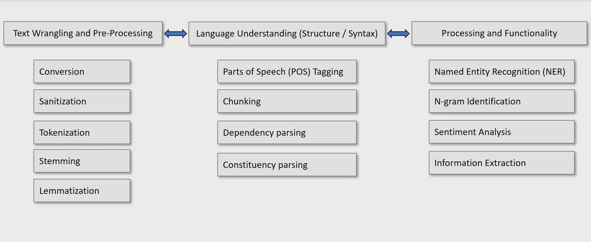

# Natural Language Processing (NLP)

Natural Language Processing (NLP) is a Machine Learning technique that enables computers to understand the context of a corpus (a body of related text). Meaning teaching computers to understand and work with human language

        Key Functions of NLP
    - Analyze and interpret text (e.g., emails, documents).
    - Interpret spoken language (e.g., sentiment analysis).
    - Synthesize speech (e.g., voice assistants).
    - Translate spoken or written phrases between languages.
    - Interpret commands and determine appropriate actions.
  ## Core Components of NLP
  

  ## Description of the flowchart
1. Text Wrangling and Pre-Processing
- Conversion – Transform text into a standardized format.
- Sanitization – Remove noise, unnecessary characters.
- Tokenization – Split text into words or phrases.
- Stemming – Reduce words to their root form (e.g., "running" → - "run").
- Lemmatization – Normalize words based on their dictionary -  meaning.
2. Language Understanding (Structure/Syntax)
- Parts of Speech (POS) Tagging – Identify nouns, verbs, adjectives, etc.
- Chunking – Group related words together.
- Dependency Parsing – Analyze grammatical relationships in a - sentence.
- Constituency Parsing – Break down a sentence into hierarchical sub-units.
3. Processing and Functionality
- Named Entity Recognition (NER) – Identify proper names (e.g., - people, places).
- N-gram Identification – Analyze word sequences to predict text.
- Sentiment Analysis – Detect emotions and opinions in text.
- Information Extraction – Identify key information from - unstructured data.
- Information Retrieval – Find relevant documents or data.
- Questions and Answering – Process user queries for precise - answers.
- Topic Modeling – Identify key themes in text data.

