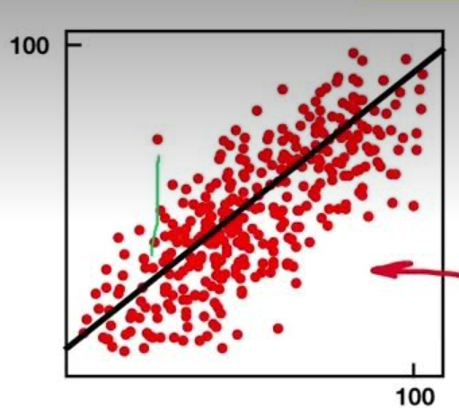

# Regression

Regression is the process of finding a function to correlate a labeled dataset into a continuous variable/number.

Outcome: Predict a variable in the future, e.g., "What will the temperature be next week?" (20°C).

**Vectors (dots)**: Represent data points plotted on a graph (e.g., X, Y dimensions).

**Regression Line**: A line drawn through the dataset to minimize the error between predicted and actual values.

**Error**: The distance of the vector (data point) from the regression line.
    
## Types of Errors Used in Regression

### Mean Squared Error (MSE)

- Calculates the average of the squared differences between predicted and actual values.
- Purpose: Penalizes larger errors more heavily.
- Use case: Suitable when large errors are highly critical.

### Root Mean Squared Error (RMSE)

- Square root of MSE, returning the error to the same units as the target variable, such as °C.
- Purpose: Easier to interpret because the units match the target.
- Use case: Commonly used for evaluating model performance.

### Mean Absolute Error (MAE)

- Calculates the average of the absolute differences between predicted and actual values.
- Purpose: Treats all errors equally without amplifying larger deviations.
- Use case: Robust to outliers and provides a simple measure of deviation.

## Key Points to Remember

- Lower error values mean better model performance.
- Use MSE or RMSE when larger errors are more problematic.
- Use MAE for a simpler, more balanced error measurement.

## Example Use Case

Predicting the temperature next week based on past weather data using regression analysis.
