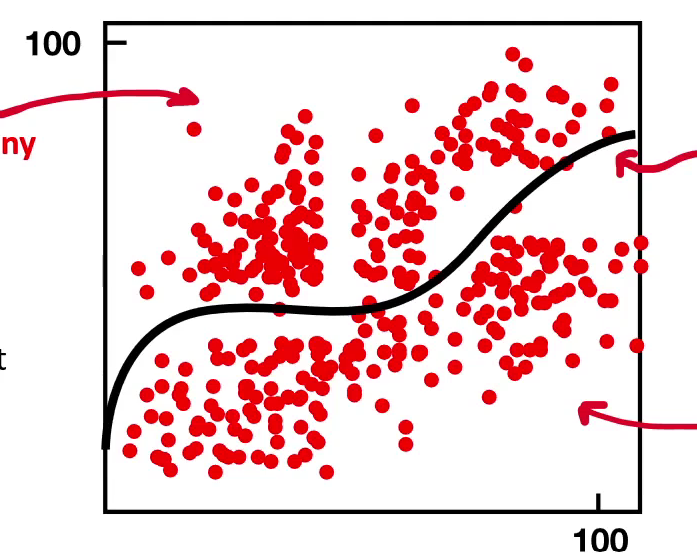

# Classification

## Definition

Classification is a process of finding a function to divide a labeled dataset into classes or categories.

## Example

Predicting a category based on input data.

Example question: Will it rain next Saturday?

Possible categories:

- Sunny
- Rainy

## Key Concept

A classification line separates the dataset into different classes.

- Data on one side belongs to Sunny.
- Data on the other side belongs to Rainy.

## Classification Algorithms

- Logistic Regression
- Decision Tree / Random Forest
- Neural Networks
- Naïve Bayes
- K-Nearest Neighbors (KNN)
- Support Vector Machines (SVM)
