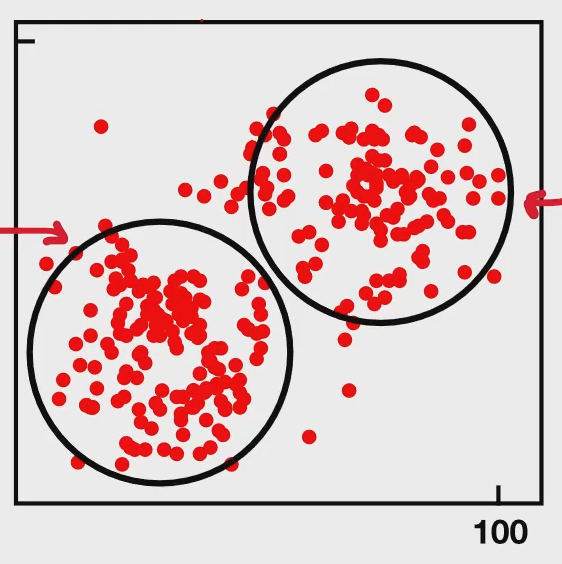

# Clustering

## Definition

Clustering is a process of grouping **unlabeled** data based on similarities and differences.

        Clustering -> Unlabeled data
        Classification -> Labeled data

It is an unsupervised learning technique, which means there are no predefined labels.

## Outcome

Groups data into clusters where members of the same cluster are more similar to each other than to those in other clusters.

## Example

Recommending whether a user is more likely to purchase a Windows computer or a Mac computer based on cluster membership.

## Clustering Algorithms

- K-means: partitions data into $k$ clusters by minimizing within-cluster variance.
- K-medoids: similar to K-means but uses actual data points as cluster centers, which makes it less sensitive to outliers.
- Density-Based (DBSCAN): forms clusters based on the density of points and works well for irregular shapes.
- Hierarchical: builds clusters in a tree-like structure using divisive or agglomerative methods.

