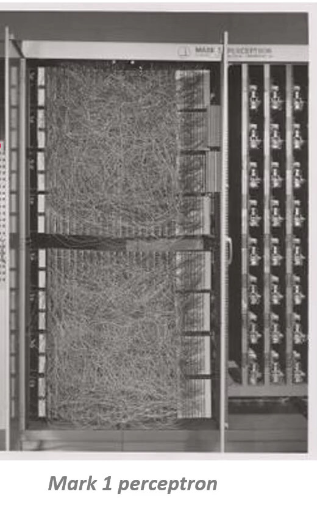

# Introduction to Perceptrons

## What is a Perceptron?

- A perceptron is an algorithm for supervised learning of binary classifiers.
- Invented in 1943, with the first perceptron machine built in 1957.
- It is a single-neuron model that served as a precursor to modern neural networks.

## Mark 1 Perceptron

- The Mark 1 perceptron was specifically designed for image recognition.
- It was an early implementation of machine learning principles.

## Key Concepts

- A perceptron consists of interconnected neurons, similar to biological neurons.
- It takes input signals, applies weights, and produces an output.
- It is mainly used for binary classification.

