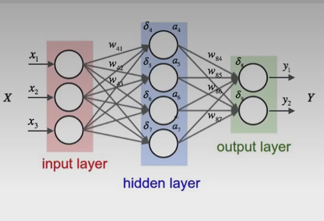

# Neural Networks & Deep Learning

## What are Neural Networks (NN)?

- Often described as inspired by the brain: networks of simple processing units (neurons) connected by weighted links.
- A neuron/node represents a small computation (weighted sum + activation).
- Data flows from one node to another along weighted connections.

### Basic layers

- Input layer → Hidden layer(s) → Output layer

## Key concepts

- Activation function: Non-linear function applied to a node's output (e.g., ReLU, sigmoid, tanh).
- Dense (fully connected) layer: Each node connects to every node in the next layer.
- Sparse layer: Fewer connections between layers (used for efficiency or structure).
- Loss function: Measures error by comparing predictions to ground truth (e.g., MSE, cross-entropy).

## What is Deep Learning?

- Deep learning refers to neural networks with multiple hidden layers (commonly 3+), enabling hierarchical feature learning.

## Types of neural networks

### Supervised deep learning models

- Feedforward / Fully-connected Neural Networks (FNN)
- Recurrent Neural Networks (RNN) — sequence data (text, time series)
- Convolutional Neural Networks (CNN) — images, spatial data

### Unsupervised deep learning models

- Autoencoders / Stacked Autoencoders (SAE) — representation learning, dimensionality reduction
- Deep Belief Networks (DBN)
- Restricted Boltzmann Machines (RBMs)

## Other important terms

- Feedforward Neural Network (FNN): No cycles; data moves in one direction.
- Backpropagation (BP): Algorithm for computing gradients and updating weights to minimize loss.
- Epoch: One full pass through the training dataset.
- Batch / Mini-batch: Subset of data used to compute an update.
- Optimizers: Algorithms for weight updates (e.g., SGD, Adam).

## Quick study tips

- Visualize small networks first to understand forward and backward passes.
- Track loss and accuracy during training to detect overfitting/underfitting.
- Start with pre-trained models (transfer learning) for image and NLP tasks to save time.

