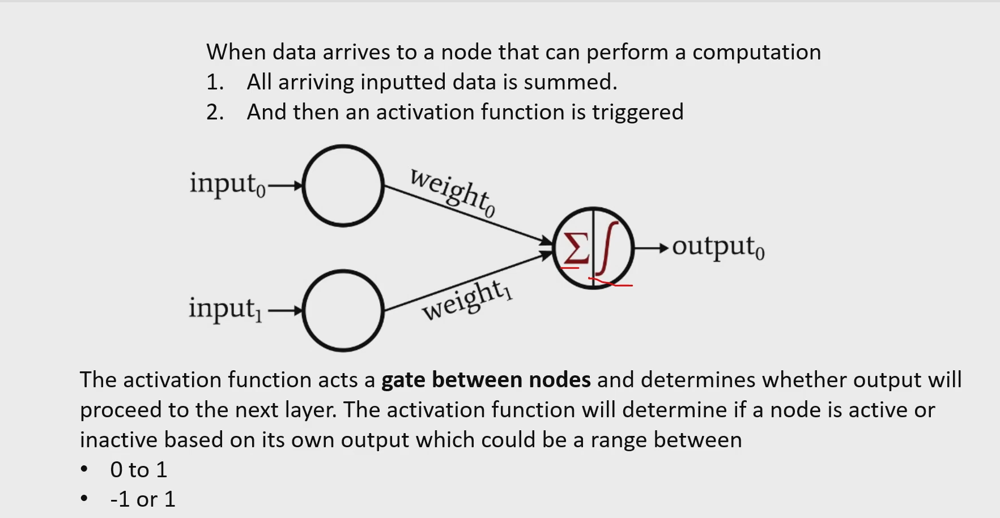
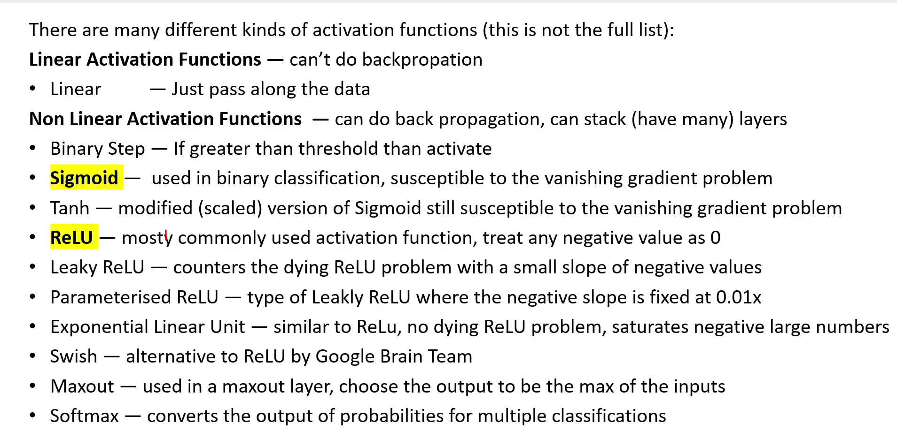

# Activation Functions

**Activation functions are the “brain” of each neuron.  
They give deep learning its ability to learn complex, non‑linear patterns — which is why modern AI works at all.**

## Types of Activation Functions

