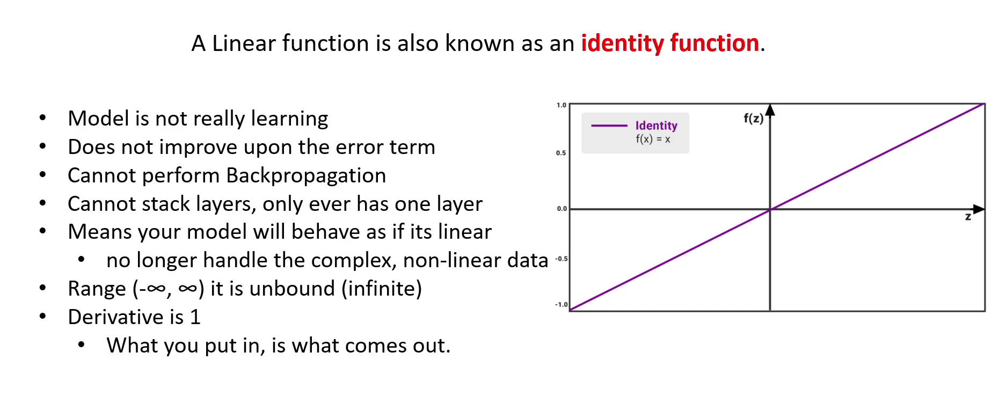

# Linear Activation Funcctions

Simple meaning:  
Output = input. No change.

Example:

Input = 7 → Output = 7

Input = –2 → Output = –2

Where it’s used:  
Regression tasks (predicting prices, temperatures, etc.)

