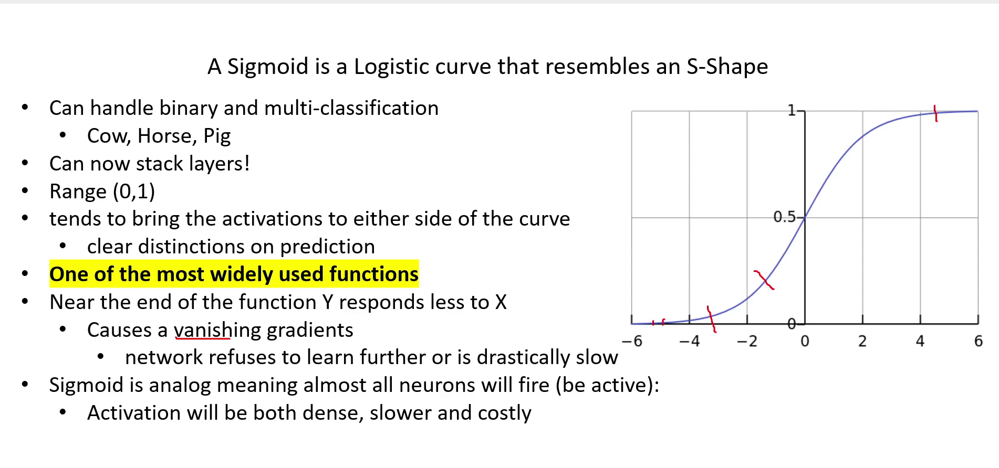

# Sigmoid Activation

Simple meaning:  
Squashes any number into a value between 0 and 1.
Think of it like a “probability maker.”

Example:

Input = 10 → Output ≈ 1

Input = –10 → Output ≈ 0

Input = 0 → Output = 0.5

Where it’s used:  
Binary classification (spam vs not spam)