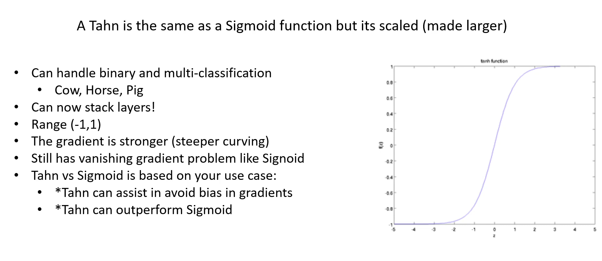

# Tahn Activation

Simple meaning:  
Like sigmoid, but outputs between –1 and 1 instead of 0 and 1.

Example:

Input = 3 → Output ≈ 0.99

Input = –3 → Output ≈ –0.99

Input = 0 → Output = 0

Why it’s used:  
Better than sigmoid because it’s centered around 0.

