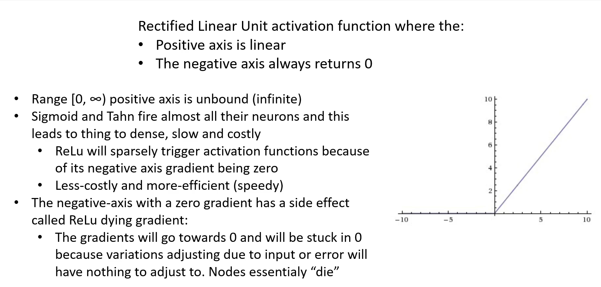

# Relu

Simple meaning:  
If the number is positive, keep it. If it’s negative, turn it into 0.

Example:

Input = 5 → Output = 5

Input = –3 → Output = 0

Why it’s used:  
Fast, simple, and works great for most deep learning models.