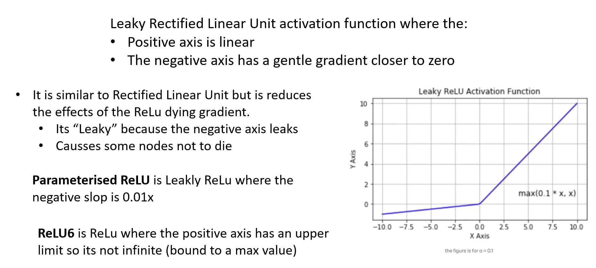

# Leaky Relu

Simple meaning:  
Same as ReLU, but instead of turning negative numbers into 0, it keeps a tiny negative value.

Example:

Input = –4 → Output ≈ –0.04 (a small negative number)

Input = 7 → Output = 7

Why it’s used:  
Prevents “dead neurons” (neurons that always output 0).

