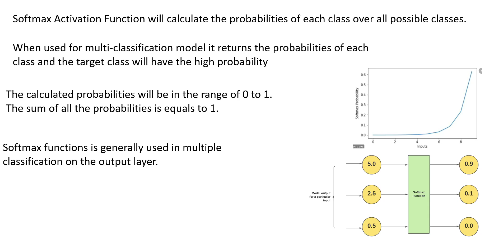

# Softmax Activation Function

Simple meaning:  
Turns a list of numbers into probabilities that add up to 1.

Example:  
Input scores: [2, 1, 0]
Softmax output (probabilities): [0.67, 0.24, 0.09]

Where it’s used:  
Multi‑class classification (digits 0–9, types of animals, etc.)

