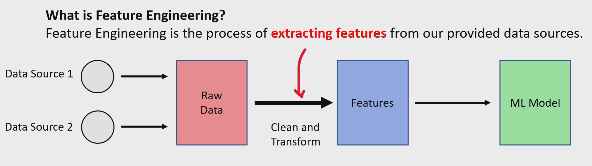

# What is a Feature?
A feature is a characteristic extracted from raw or unstructured data that has been prepared for use by an ML model to make predictions. 
ML models generally only accept numerical data, so we must convert data into a machine-readable format using encoding (to be covered later in detail). 

What is Feature Engineering?

Feature Engineering is the process of extracting, cleaning, and transforming features from data sources to make them usable for ML models. 
This step improves model performance by providing the most relevant data representations. 

Feature Engineering Workflow

- Data Source(s) → Raw input data (unstructured or semi-structured)
- Raw Data → Clean and transform data
- Features → Structured, numerical, or encoded form ready for modeling
- ML Model → Uses features to generate predictions

Summary

Feature = Input variable used by an ML model.  
Feature Engineering = Process of turning raw data into usable features. 
Encoding converts categorical data into numeric form for ML models. 

EX-  
Suppose you want to predict house prices.

**Raw data:**

Address

Year built

Number of rooms

Square footage

Distance to metro

Crime rate

**Feature engineering might create:**

House age = 2026 – year built

Price per square foot

Is_near_metro (yes/no)

Neighborhood safety score

These new features help the model learn patterns more easily.