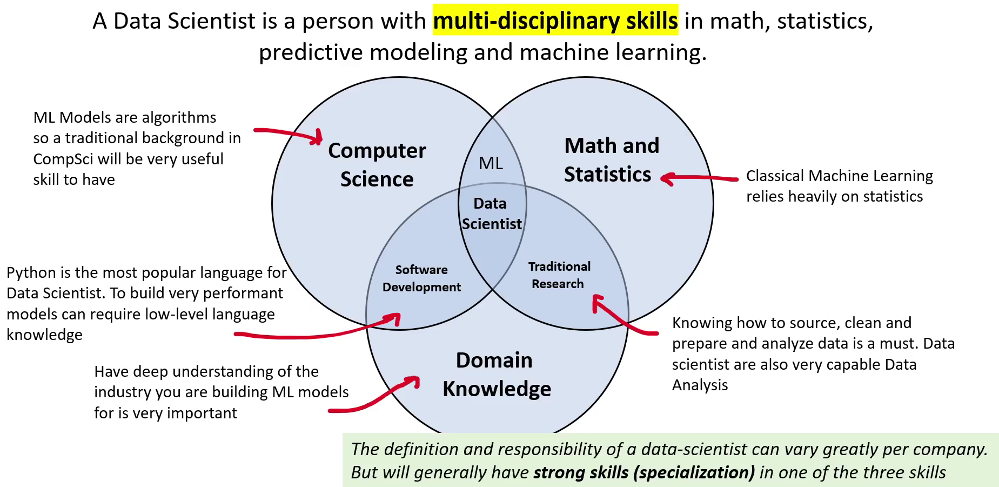

# Data Scientist

## Low-level languages are closer to machine code, providing direct control over hardware and memory, while high-level languages are designed to be human-readable, using English-like syntax to simplify complex logical tasks