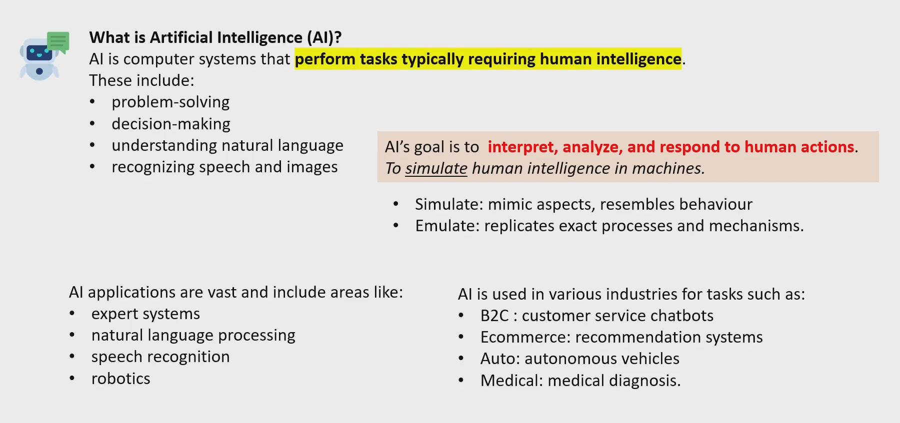
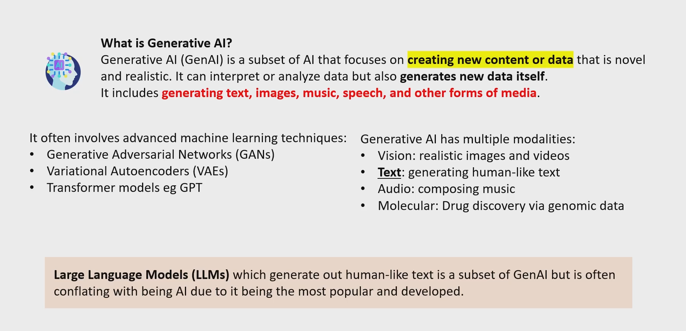
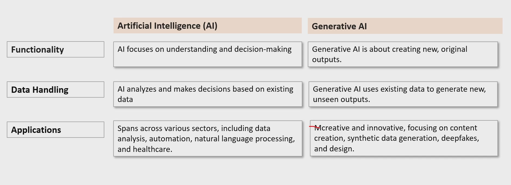

# AI vs Generative AI

**Emulate is the real visualization of the humand mind which is like AGI(Artificial General Intellegencce)**

**Modalities are like senses(vision, touch, test ..)**

**Its not that Gen AI does not have decision making functinality like AI, We are saying it has that and creating new output functionality on top.**