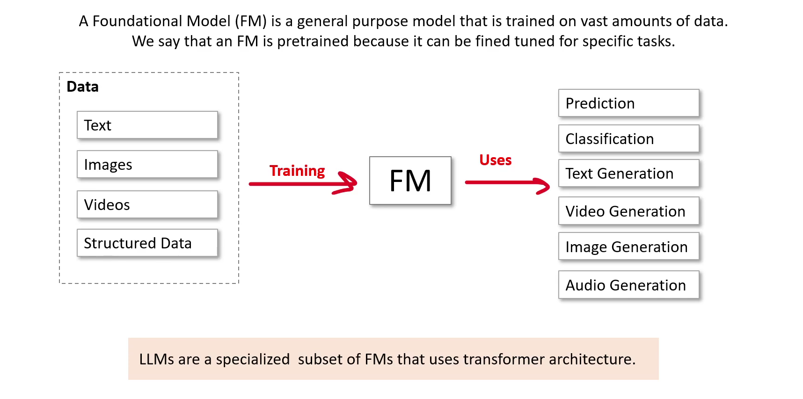

# Foundational Model

**A Transformer is a deep learning architecture that processes entire sequences (text, images, audio) in parallel using a mechanism called self‑attention.**

**This allows the model to understand relationships between all elements in the input at once, rather than step‑by‑step like older RNNs/LSTMs. This parallelism is what unlocked today’s massive AI models.**

***Example*: In the sentence “The cat sat on the mat because it was tired,” the model learns that “it” refers to “cat.”**