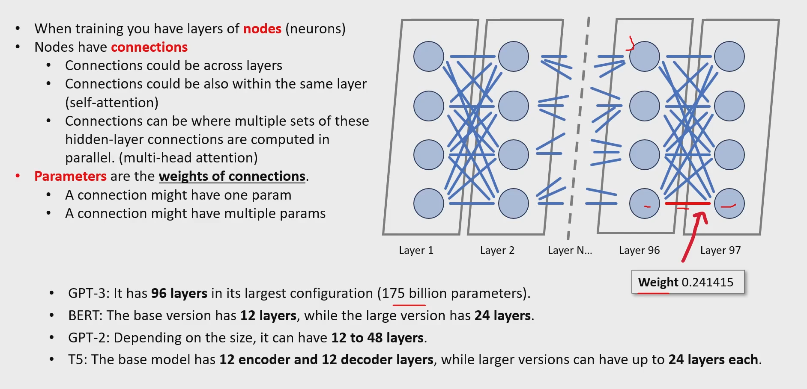
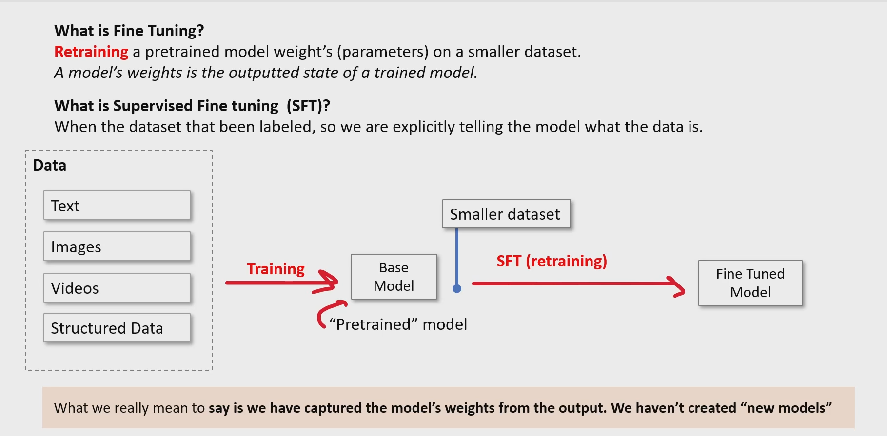
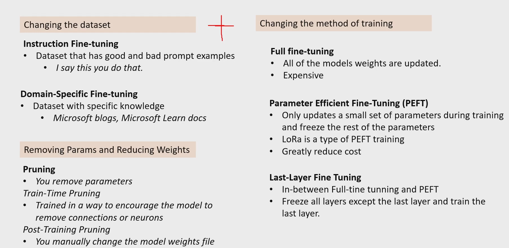

# Fine Tunning LLMs

**Fine-tuning means making small, precise adjustments to something so it works as perfectly as possible. so we are tweeking the amount of layers, amount of connections ...**

# foundational model vs base model vs pretrained model

**1) Foundational model → A very large, general‑purpose model trained on massive multimodal data that can be adapted to many downstream tasks.**
    **-A “foundation” you can build many applications on top of.**

**2) A base model is the untuned, raw version of a foundational model.**
    **-**
    **-Base model is a type of foundational model (the raw one)**

**3) A pretrained model is any model that has already been trained on data before you use it. This term is broader than foundational model.**
    **-Pretrained = “already learned something before you got it.”**

